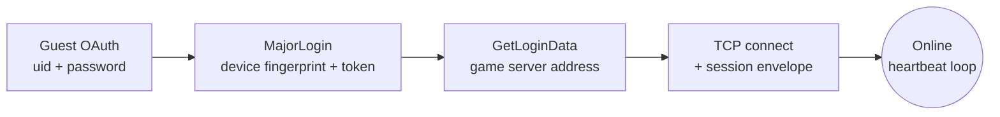

<div align="center">

# freefire-connect

**Minimal, dependency-light Python client that logs a Free Fire *guest* account in and keeps it online — nothing else.**

No room creation. No match logic. No gameplay. Just the connection.

[](https://www.python.org/)
[](LICENSE)
[-orange)](#usage)

</div>

---

## How it works

It reproduces the same handshake the mobile client does on boot:



| Step | What happens |
|---|---|
| `_guest_oauth` | `POST 100067.connect.garena.com/oauth/guest/token/grant` with the guest uid/password → `access_token` + `open_id`. |
| `_major_login` | Builds a `MajorLoginReq` (device fingerprint + the OAuth token), encrypts it with the client's fixed AES envelope key, and `POST`s it to the login backend → a per-session AES key/IV and a session JWT. |
| `_get_login_data` | Exchanges the JWT for the game server's address (`Online_IP_Port`). |
| `connect` | Opens a plain TCP socket to that address and sends a small handshake envelope built from the JWT + per-session key. |
| `keep_alive` | Reads the socket; if the server goes quiet for a while, sends a heartbeat so the session isn't dropped. |

## Why this exists

This is the shared first step any Free Fire automation/bot project needs — getting (and keeping) a session online — split out on its own so it can be read, audited, or reused without pulling in an entire bot's worth of unrelated code (rooms, payments, Discord integration, etc).

## Requirements

- Python 3.10+
- A Free Fire **guest** account (`uid` + `password`). This project does not create guest accounts for you — it only logs one in.

```bash
pip install -r requirements.txt
```

## Usage

No `.env`, no config file — pass credentials as arguments (you'll be prompted for the password if you leave it out):

```bash
python main.py <uid> <password>
python main.py <uid> <password> --seconds 120   # stay online longer
python main.py <uid>                            # prompts for the password
```

<details>
<summary><strong>Example output</strong></summary>

```
[login] authenticating uid=123456789 ...
[login] ok - account_id=987654321 nickname='UID-123456789'
[connect] opening TCP session to 203.0.113.10:60077 ...
[connect] online. keeping session alive for 60s (Ctrl+C to stop early)
[disconnect] closing session
```

</details>

## Using it as a library

```python
import asyncio
from ff_connect import FreeFireClient

async def main():
    async with FreeFireClient(uid="123456789", password="...") as client:
        await client.login()
        print(client.account_id, client.nickname)

        await client.connect()
        await client.keep_alive(seconds=30, on_data=lambda pkt: print(len(pkt), "bytes"))

asyncio.run(main())
```

## Project layout

```
freefire-connect/
├── main.py                          CLI entrypoint
└── ff_connect/
    ├── client.py                    FreeFireClient — login + TCP session
    ├── packets.py                   MajorLoginReq wire-format builder
    ├── crypto.py                    AES envelope/packet encryption
    └── protobufs/                   generated protobuf messages
```

## Disclaimer

> [!WARNING]
> This talks to Free Fire's client-facing servers using a reverse-engineered version of the protocol the official mobile client speaks. It is **not** an official Garena/111 Dots Studio SDK and is **not affiliated** with them. Use it only against your own guest accounts — this may be against Garena's Terms of Service, and guest accounts used this way can be banned. Shared for research/educational purposes; you are responsible for how you use it.

## License

[MIT](LICENSE)
