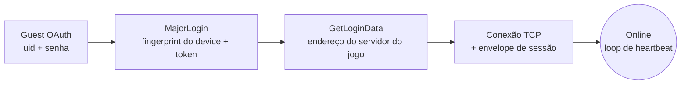

<div align="center">

# freefire-connect

**Cliente Python mínimo e com poucas dependências que loga uma conta *guest* do Free Fire e mantém ela online — só isso.**

Sem criação de sala. Sem lógica de partida. Sem gameplay. Só a conexão.

[](https://www.python.org/)
[](LICENSE)
[-orange)](#uso)

</div>

---

## Como funciona

Reproduz o mesmo handshake que o app mobile faz ao abrir:



| Etapa | O que acontece |
|---|---|
| `_guest_oauth` | `POST 100067.connect.garena.com/oauth/guest/token/grant` com o uid/senha da conta guest → `access_token` + `open_id`. |
| `_major_login` | Monta um `MajorLoginReq` (fingerprint do device + o token do OAuth), criptografa com a chave AES fixa do envelope do cliente, e manda via `POST` pro backend de login → devolve uma chave/IV AES por sessão e um JWT de sessão. |
| `_get_login_data` | Troca o JWT pelo endereço do servidor do jogo (`Online_IP_Port`). |
| `connect` | Abre um socket TCP puro pra esse endereço e manda um pequeno envelope de handshake montado a partir do JWT + chave da sessão. |
| `keep_alive` | Lê o socket; se o servidor ficar quieto por um tempo, manda um heartbeat pra sessão não cair. |

## Por que isso existe

Esse é o primeiro passo em comum que qualquer projeto de automação/bot de Free Fire precisa — conseguir (e manter) uma sessão online — separado por si só pra poder ser lido, auditado ou reaproveitado sem precisar puxar um bot inteiro cheio de código sem relação (salas, pagamentos, integração com Discord, etc).

## Requisitos

- Python 3.10+
- Uma conta **guest** do Free Fire (`uid` + `senha`). Este projeto não cria contas guest pra você — ele só faz login numa que já existe.

```bash
pip install -r requirements.txt
```

## Uso

Sem `.env`, sem arquivo de config — as credenciais são passadas por argumento (se você deixar a senha de fora, ela é pedida na hora):

```bash
python main.py <uid> <senha>
python main.py <uid> <senha> --seconds 120   # fica online por mais tempo
python main.py <uid>                         # pede a senha no prompt
```

<details>
<summary><strong>Exemplo de saída</strong></summary>

```
[login] authenticating uid=123456789 ...
[login] ok - account_id=987654321 nickname='UID-123456789'
[connect] opening TCP session to 203.0.113.10:60077 ...
[connect] online. keeping session alive for 60s (Ctrl+C to stop early)
[disconnect] closing session
```

</details>

## Usando como biblioteca

```python
import asyncio
from ff_connect import FreeFireClient

async def main():
    async with FreeFireClient(uid="123456789", password="...") as client:
        await client.login()
        print(client.account_id, client.nickname)

        await client.connect()
        await client.keep_alive(seconds=30, on_data=lambda pkt: print(len(pkt), "bytes"))

asyncio.run(main())
```

## Estrutura do projeto

```
freefire-connect/
├── main.py                          ponto de entrada da CLI
└── ff_connect/
    ├── client.py                    FreeFireClient — login + sessão TCP
    ├── packets.py                   montagem do MajorLoginReq (wire format)
    ├── crypto.py                    criptografia AES do envelope/pacotes
    └── protobufs/                   mensagens protobuf geradas
```

## Aviso

> [!WARNING]
> Isso conversa com os servidores voltados ao cliente do Free Fire usando uma versão de engenharia reversa do protocolo que o app mobile oficial fala. **Não** é um SDK oficial da Garena/111 Dots Studio e **não tem afiliação** com eles. Use só contra suas próprias contas guest — isso pode ir contra os Termos de Serviço da Garena, e contas guest usadas assim podem ser banidas. Compartilhado pra fins de pesquisa/educacionais; você é responsável por como usa.

## Licença

[MIT](LICENSE)
